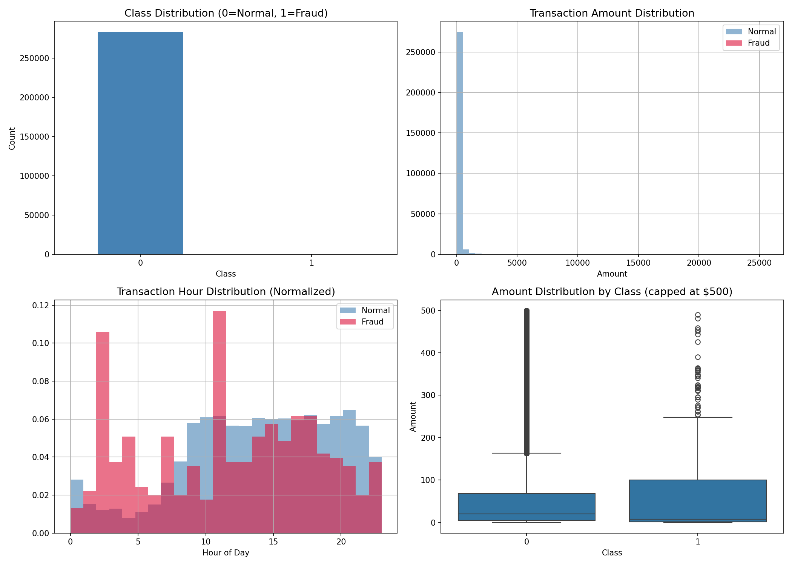
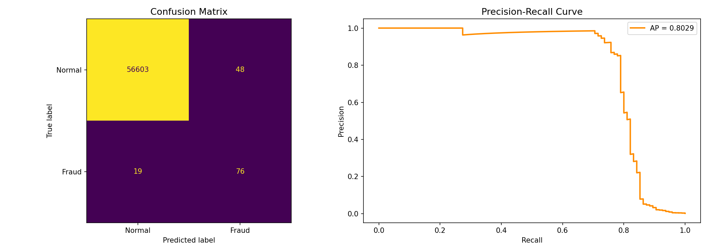
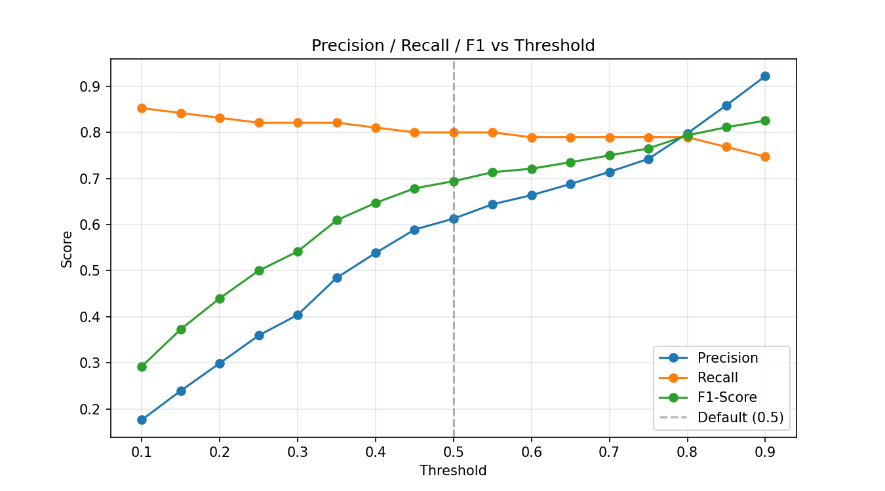
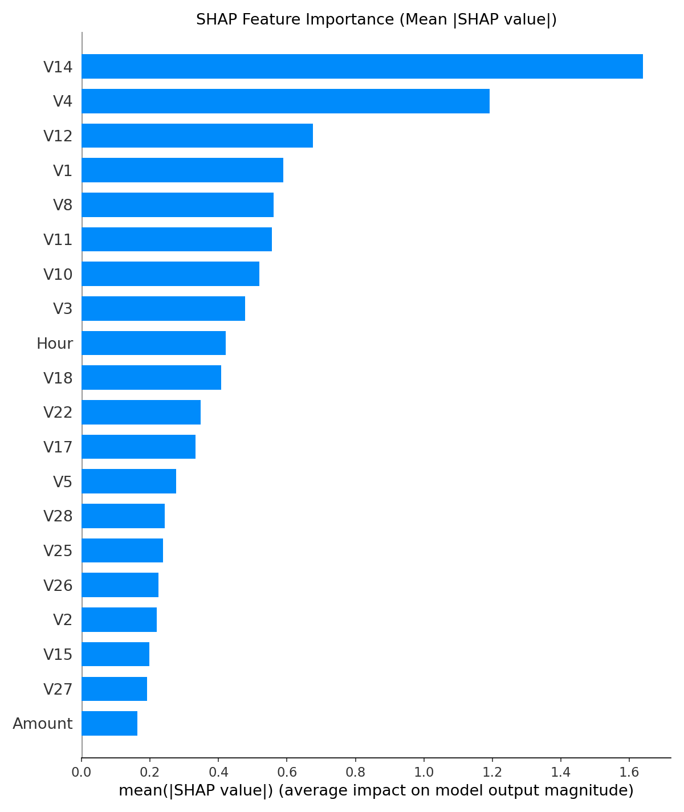

# Credit Card Fraud Detection using XGBoost


An end-to-end machine learning pipeline for detecting fraudulent credit card transactions, addressing extreme class imbalance with SMOTE and explaining model decisions with SHAP.

**Dataset:** [Credit Card Fraud Detection (Kaggle)](https://www.kaggle.com/datasets/mlg-ulb/creditcardfraud)

---

## Project Overview

Credit card fraud costs financial institutions and customers billions of dollars annually. The core challenge is not a lack of data — it is **extreme class imbalance**. Fraudulent transactions account for less than 0.2% of all transactions, which means a naive model can achieve over 99% accuracy while never catching a single fraud case.

This project builds a complete fraud detection pipeline using **XGBoost**, addresses class imbalance with **SMOTE**, tunes the decision threshold based on the precision-recall trade-off, and uses **SHAP** to interpret individual model predictions.

## Problem Statement

Given 284,807 anonymized credit card transactions made by European cardholders in September 2013, classify each transaction as fraudulent (1) or legitimate (0).

## Approach

1. **Data Quality Check** — verified no missing values; identified and removed 1,081 duplicate rows (only 19 of which were fraud cases, statistically implausible to be genuine distinct events given 30 continuous features).
2. **Exploratory Data Analysis** — examined class imbalance, transaction amount patterns, and time-of-day fraud trends.
3. **Feature Engineering** — extracted an `Hour` feature from the raw `Time` column after EDA revealed distinct hourly fraud patterns.
4. **Preprocessing** — scaled `Amount` and `Hour`; split data (80/20, stratified) before applying SMOTE to prevent data leakage.
5. **Modeling** — trained an XGBoost classifier optimized for PR-AUC.
6. **Evaluation** — assessed performance using Precision, Recall, F1, ROC-AUC, and PR-AUC (accuracy is not meaningful on imbalanced data).
7. **Threshold Tuning** — analyzed the precision/recall trade-off across thresholds to select an operating point suited to fraud detection priorities.
8. **Explainability** — used SHAP to identify which features drive individual predictions.

## Key Results

| Metric | Score |
|---|---|
| ROC-AUC | 0.9757 |
| Average Precision (PR-AUC) | 0.8029 |
| Precision (Fraud class) | 0.61 |
| Recall (Fraud class) | 0.80 |
| F1-Score (Fraud class) | 0.69 |

At the default 0.5 threshold, the model correctly identifies **76 of 95** fraud cases in the test set, with 48 false alarms. Threshold analysis showed that lowering the threshold below 0.5 yields negligible recall gains at a severe precision cost, confirming 0.5 as a strong operating point for this use case.

> **Why not pick the threshold with the highest F1-score?** The threshold sweep shows F1 peaking at 0.826 (threshold = 0.90), higher than the 0.694 achieved at threshold = 0.5. However, that higher F1 comes from trading recall (0.800 → 0.747) for precision — meaning more fraud cases go undetected. In fraud detection, a missed fraud case (false negative) typically carries a far higher real-world cost than a false alarm (false positive), which only costs a manual review. F1 treats precision and recall as equally important, but this problem doesn't. The threshold (0.5) was therefore chosen to prioritize recall, not to maximize the F1 metric in isolation — a deliberate trade-off, not an oversight.

### Class Distribution


### Evaluation: Confusion Matrix & Precision-Recall Curve


### Threshold Tuning


### SHAP Feature Importance


## Key Findings

- **V14, V4, and V12** (anonymized PCA components) are the strongest fraud predictors.
- The engineered **`Hour`** feature ranks 9th of 30 in importance, validating the decision to retain time-of-day information rather than discarding it.
- **`Amount`**, often assumed to be a strong fraud signal, ranks as the *least* important feature — challenging the common assumption that larger transactions are more likely to be fraudulent.
- Fraudulent transactions show a lower median amount than legitimate ones, suggesting fraudsters favor smaller, less conspicuous transactions.

## Project Structure

```
fraud-detection-xgboost/
│
├── README.md
├── requirements.txt
├── fraud_detection.ipynb
├── .gitignore
│
├── images/
│   ├── eda_plots.png
│   ├── evaluation_plots.png
│   ├── threshold_tuning.png
│   ├── shap_importance.png
│   └── shap_summary.png
│
└── models/
    ├── xgb_fraud_model.pkl
    └── scaler.pkl
```

## Installation

```bash
git clone https://github.com/<your-username>/fraud-detection-xgboost.git
cd fraud-detection-xgboost
pip install -r requirements.txt
```

## Usage

1. Download the dataset from [Kaggle](https://www.kaggle.com/datasets/mlg-ulb/creditcardfraud) and place `creditcard.csv` in the project root.
2. Run `fraud_detection.ipynb` end to end.
3. The trained model and scaler are saved to `models/`.

## Tech Stack

- Python, pandas, NumPy
- scikit-learn, imbalanced-learn (SMOTE)
- XGBoost
- SHAP
- matplotlib, seaborn

## License

This project is licensed under the MIT License.
